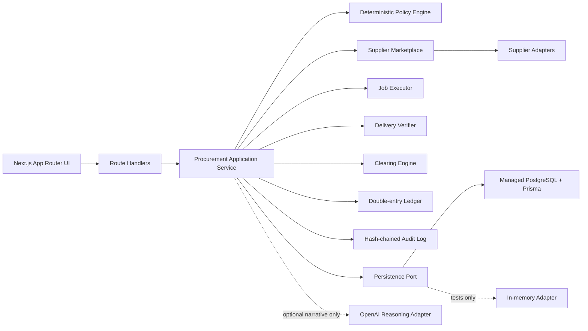

# Cantina

**The procurement, clearing, and settlement network where autonomous AI agents buy the resources they need.**

Cantina V1 demonstrates the complete commercial control loop for an autonomous agent purchase:

1. Accept a workload and purchasing constraints.
2. Enforce a deterministic purchasing mandate.
3. Discover and compare machine-readable supplier offers.
4. Exclude non-compliant quotes.
5. Select the highest-ranked compliant supplier.
6. Place a simulated authorization hold.
7. Execute a mock workload.
8. Verify delivery evidence.
9. Issue a clearing decision.
10. Settle balanced ledger entries and append a hash-chained audit trail.

The language model is deliberately outside the money path. It may explain a decision, but application code controls eligibility, authorization, clearing, and settlement.

## Current implementation

The repository contains a tested first vertical slice with:

- Next.js 16 App Router, React 19, TypeScript, and Tailwind CSS.
- Deterministic policy evaluation and supplier filtering.
- Three seeded suppliers: Atlas GPU, Nova Compute, and Vault AI.
- Deterministic supplier scoring after compliance filtering.
- Idempotent simulated authorization, capture, supplier settlement, and initial funding.
- Double-entry ledger constructors that reject unbalanced postings.
- Mock workload execution and SHA-256 delivery verification.
- Hash-chained append-only audit events.
- Dashboard, new request, purchase decision, execution result, transactions, suppliers, mandates, and audit log pages.
- PostgreSQL/Prisma persistence for Vercel deployments.
- Vitest unit and workflow tests plus a Playwright critical-flow specification.

In deployment, Cantina uses managed PostgreSQL through `DATABASE_URL` and persists purchase requests, quotes, decisions, authorizations, jobs, delivery evidence, clearing decisions, ledger entries, and audit events. When no database URL is present, it falls back to the process-local adapter for isolated development and unit tests only.

## Version 1 scope

### In scope

- One demo organization, user, agent, and active mandate.
- Inference and compute purchasing categories.
- Fixed simulated supplier offers.
- Per-job and per-day spending limits.
- Reliability, deadline, region, privacy, data-residency, vendor allowlist, and customer-data controls.
- Human-approval threshold detection.
- Authorization holds using simulated credits.
- Mock workload execution.
- Output count, content, and checksum verification.
- `DELIVERED`, `PARTIAL`, `FAILED`, and `DISPUTED` clearing states in the domain model.
- Full settlement for verified delivery.
- Internal double-entry ledger using integer minor units.
- Audit event sequencing and hash chaining.
- Read-only supplier and mandate administration views.

### Explicitly out of scope for V1

- Real money, crypto, blockchain, USDC, x402, or Coinbase AgentKit.
- Real cloud provider execution.
- Autonomous access to unrestricted funds.
- Production authentication, KYC/KYB, custody, money transmission, or regulated settlement.
- Dynamic auctions or order books.
- Multi-currency accounting.
- Cross-organization supplier contracts.
- Production dispute adjudication.
- High-volume asynchronous orchestration.

## System architecture



### Architectural boundaries

- **Domain:** pure TypeScript rules, state machines, ledger posting constructors, and delivery verification.
- **Application:** orchestration of one procurement transaction from request through settlement.
- **Infrastructure:** persistence, supplier connectors, job runners, payment rails, and external model APIs.
- **Presentation:** Next.js pages, route handlers, and client form components.

MCP, A2A, x402, AgentKit, USDC, and real compute providers should enter as adapters. They must not rewrite the policy or accounting core.

## Purchasing state machine

```text
CREATED
  ├─> POLICY_EVALUATED
  │     ├─> QUOTED
  │     │     ├─> DECIDED
  │     │     │     ├─> AWAITING_APPROVAL
  │     │     │     │     └─> AUTHORIZED
  │     │     │     └─> AUTHORIZED
  │     │     │           └─> EXECUTING
  │     │     │                 └─> VERIFYING
  │     │     │                       └─> CLEARING
  │     │     │                             ├─> SETTLED
  │     │     │                             ├─> DISPUTED
  │     │     │                             └─> FAILED
  │     │     └─> REJECTED
  │     └─> REJECTED
  ├─> REJECTED
  └─> FAILED
```

Invalid transitions throw before state mutation.

## Clearing and settlement state machine

```text
PENDING
  ├─> DELIVERED ─> SETTLED
  ├─> PARTIAL ───> SETTLED | HELD_FOR_REVIEW
  ├─> FAILED ────> REFUNDED
  └─> DISPUTED ──> HELD_FOR_REVIEW | SETTLED | REFUNDED
```

| Clearing decision | Financial behavior |
|---|---|
| `DELIVERED` | Capture full authorized amount, recognize platform fee, create supplier payable, settle supplier. |
| `PARTIAL` | Capture an adjusted amount, release remainder, then settle the adjusted supplier payable. |
| `FAILED` | Release the hold or refund captured funds. |
| `DISPUTED` | Keep funds held pending review. |

Only the `DELIVERED` happy path is wired into the current UI workflow. The other states and posting primitives are the next implementation checkpoint.

## Double-entry ledger model

No mutable balance is stored on a user or organization. Balances are derived from immutable entries.

| Account | Type | Purpose |
|---|---|---|
| `ORG:<slug>:CUSTOMER_AVAILABLE` | Liability | Credits available to the customer. |
| `ORG:<slug>:CUSTOMER_HELD` | Liability | Authorized credits reserved for a purchase. |
| `SYSTEM:SUPPLIER_PAYABLE` | Liability | Amount owed to suppliers after capture. |
| `SYSTEM:PLATFORM_REVENUE` | Revenue | Cantina platform fee. |
| `SYSTEM:REFUND_LIABILITY` | Liability | Refund obligations after capture. |
| `SYSTEM:SIMULATED_SETTLEMENT` | Asset | Simulated cash/settlement account. |

Every transaction requires positive integer minor units and equal total debits and credits. Financial operations carry unique idempotency keys.

## Database design

The Prisma schema contains the required models plus membership and role support:

```text
users
organizations
organization_members
agents
agent_mandates
suppliers
supplier_offers
purchase_requests
supplier_quotes
purchase_decisions
purchase_authorizations
jobs
job_outputs
delivery_evidence
clearing_decisions
ledger_accounts
ledger_transactions
ledger_entries
audit_events
```

Key design choices:

- Money is always `Int` minor units.
- Reliability and reputation are integer basis points.
- Policies are versioned records, not mutable blobs attached to agents.
- Supplier quotes snapshot the commercial and compliance facts used for a decision.
- Purchase decisions point to one selected quote.
- Audit events have organization-scoped sequence numbers and hash-chain fields.
- Ledger transactions are immutable records with debit and credit entries.
- Idempotency keys are unique at the purchase request and ledger transaction layers.

See [`prisma/schema.prisma`](prisma/schema.prisma) and [`docs/DATABASE.md`](docs/DATABASE.md).

## Repository structure

```text
cantina/
├── .github/workflows/ci.yml
├── docs/
├── prisma/
│   ├── schema.prisma
│   └── seed.ts
├── src/
│   ├── app/
│   ├── components/
│   ├── domain/
│   ├── infrastructure/persistence/
│   ├── integrations/openai/
│   └── lib/
├── tests/e2e/
├── vercel.json
├── playwright.config.ts
├── vitest.config.ts
└── package.json
```

## Deploy to Vercel

Cantina does not require Docker. The intended V1 runtime is:

```text
GitHub repository → Vercel → managed PostgreSQL from the Vercel Marketplace
```

1. In Vercel, choose **Add New → Project** and import this repository.
2. Open **Storage** and provision Prisma Postgres or Neon.
3. Connect the database so Vercel injects `DATABASE_URL`.
4. Deploy.
5. Open `/api/health`. A durable deployment reports `"persistence":"postgresql"`.
6. Submit the prefilled request at `/purchase-requests/new`.

The Vercel build script is:

```bash
prisma db push --skip-generate && next build
```

For the initial MVP, `db push` creates the schema without requiring a local database. Before multiple shared environments or destructive schema changes, replace this with committed Prisma migrations and `prisma migrate deploy`.

### Expected first transaction

- Atlas GPU is rejected because 97% reliability is below the 99% floor.
- Vault AI is rejected because its $0.44 quote exceeds the $0.30 budget.
- Nova Compute is selected at $0.26 with 99% reliability and a 52-second estimate.
- 100 mock descriptions are generated and checksum-verified.
- The job clears as `DELIVERED` and settles for $0.26.
- The transaction remains visible after serverless instances recycle because it is stored in PostgreSQL.

## Optional local development

Local development does not require Docker. Without `DATABASE_URL`, Cantina uses the in-memory test adapter:

```bash
git clone https://github.com/patricktran1/cantina.git
cd cantina
npm install
npm run dev
```

To develop locally against the same managed database as Vercel:

```bash
npm i -g vercel
vercel link
vercel env pull .env.local
npm run dev
```

## Test and verification commands

```bash
npm run lint
npm test
npm run test:coverage
npx playwright install chromium
npm run test:e2e
npm run build
```

Run the full non-browser gate:

```bash
npm run check
```

## Environment variables

| Variable | Required | Purpose |
|---|---:|---|
| `DATABASE_URL` | Deployment | Managed PostgreSQL connection string injected by Vercel Marketplace storage. |
| `OPENAI_API_KEY` | No | Enables optional narrative generation only. |
| `OPENAI_REASONING_MODEL` | No | Model used for narrative generation. |
| `CANTINA_DEMO_USER_EMAIL` | No | Email used by the temporary demo identity bootstrap. |
| `CANTINA_DEMO_ORG_SLUG` | No | Organization slug used by the temporary demo tenant bootstrap. |

Never expose `OPENAI_API_KEY` in a browser bundle. Never allow an LLM response to directly post ledger entries or mutate authorization state.

## Initial implementation plan

1. **Foundation and domain kernel**: complete.
2. **Verified happy-path vertical slice**: complete.
3. **Managed PostgreSQL persistence adapter**: complete for the Vercel MVP; next hardening step is serializable transaction boundaries and database-backed concurrency tests.
4. **All clearing outcomes**: implement partial capture, hold release, refunds, disputes, and manual review.
5. **Human approvals**: add approval requests, expiry, actor identity, and audit evidence.
6. **Background execution**: add an outbox and Inngest or Trigger.dev adapter with retry-safe job steps.
7. **Real supplier adapter**: connect one model API behind the same supplier interface.
8. **Production identity and tenancy**: add Clerk or Auth.js, organization roles, and scoped authorization.
9. **Financial hardening**: database constraints, append-only triggers, reconciliation jobs, ledger snapshots, and invariant monitoring.
10. **Agent protocols and payment rails**: MCP/A2A discovery first, then x402/USDC only after the commercial and accounting model is proven.

## Non-negotiable invariants

- The LLM never has unrestricted control over funds.
- Policy enforcement is deterministic and server-side.
- Every ledger transaction balances before posting.
- Money uses integer minor units only.
- Financial writes are idempotent.
- Audit evidence is append-only and tamper-evident.
- Supplier selection uses only compliant quotes.
- Delivery evidence drives clearing behavior.
- No secret is committed to Git.
